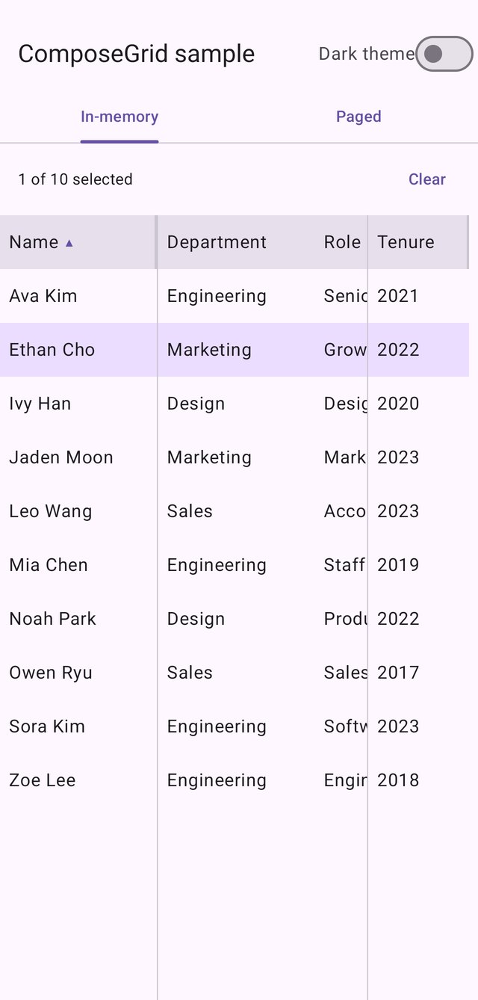
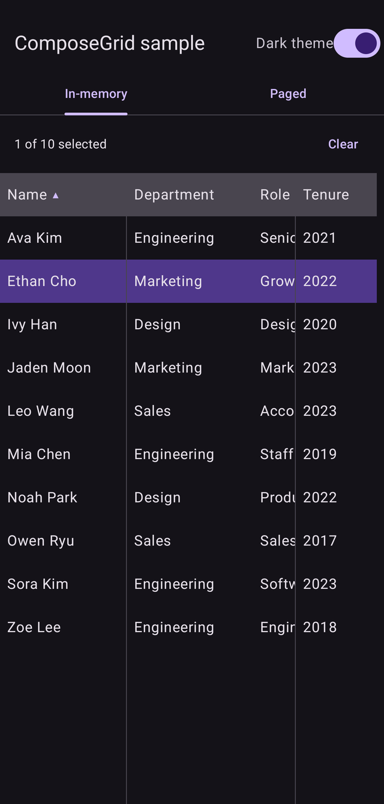
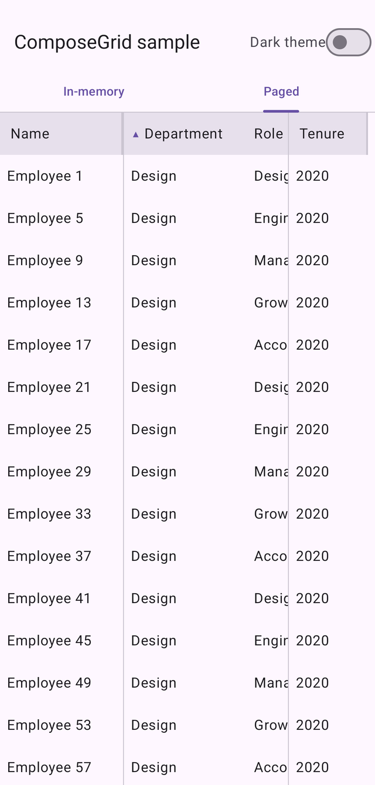

# ComposeGrid

A performant, virtualized data table for Jetpack Compose.

[](https://central.sonatype.com/artifact/io.github.hagosalema/grid-core)
[](LICENSE)

> **`0.x` — the API may still change between minor versions.**

| Sorting & selection | Dark theme | Paged, server-side sort |
|:---:|:---:|:---:|
|  |  |  |

Left and right columns stay pinned while the middle scrolls. Screenshots from
[`sample-app`](sample-app/src/main/kotlin/io/github/composegrid/sample/MainActivity.kt).

## Install

```kotlin
dependencies {
    implementation("io.github.hagosalema:grid-core:0.2.0")

    // optional
    implementation("io.github.hagosalema:grid-material3:0.2.0") // Material3 defaults
    implementation("io.github.hagosalema:grid-paging:0.2.0")    // Paging 3 support
}
```

`grid-core` depends on neither Material3 nor Paging, so it works with your own
design system. Requires minSdk 24.

## Quick start

```kotlin
val columns = remember {
    listOf(
        GridColumn<Employee>(
            id = "name",
            header = { Text("Name") },
            width = GridColumnWidth.Range(min = 80.dp, max = 200.dp, initial = 140.dp),
            sortable = true,
            comparator = compareBy { it.name },
            pinned = ColumnPin.Start,
            cell = { Text(it.name) },
        ),
        GridColumn<Employee>(
            id = "department",
            header = { Text("Department") },
            width = GridColumnWidth.Fixed(140.dp),
            sortable = true,
            comparator = compareBy { it.department },
            cell = { Text(it.department) },
        ),
    )
}
val gridState = rememberGridState()

DataGrid(
    columns = columns,
    dataSource = rememberSortedGridDataSource(employees, columns, gridState),
    state = gridState,
    style = GridDefaults.style(), // from grid-material3
    rowKey = { it.id },
)
```

Hold `columns` and `style` in `remember` — `DataGrid` keys internal item
providers on them.

A runnable demo covering every feature is in
[`sample-app`](sample-app/src/main/kotlin/io/github/composegrid/sample/MainActivity.kt).

## Features

**Real 2D virtualization.** Only cells whose row *and* column intersect the
viewport are composed, measured, and placed — built directly on `LazyLayout`
rather than layered over `LazyColumn`.

**Column sizing**

| `GridColumnWidth` | Behaviour |
|---|---|
| `Fixed(dp)` | Exact width, ignored by weighted distribution |
| `Weighted(f)` | Splits leftover space proportionally |
| `Range(min, max, initial)` | User-resizable by dragging the header edge |

**Column freezing.** Set `pinned = ColumnPin.Start` or `ColumnPin.End`. Pinned
columns are exempt from horizontal scroll but share the vertical scroll state, so
they stay in lockstep with the rest of the grid. Any number can be pinned to
either edge.

**Sorting.** Clicking a header cycles ascending → descending → none. `DataGrid`
owns the sort state but never reorders your data, because a paged or
network-backed source can only be ordered at the source.

*In-memory* — give sortable columns a `comparator` and wrap your list:

```kotlin
val dataSource = rememberSortedGridDataSource(items, columns, gridState)
```

*Server-side* — leave `comparator` null, keep `sortable = true`, and react to the
change. A sortable column with no comparator is the deliberate signal for "the
backend orders this."

```kotlin
DataGrid(
    columns = columns,
    dataSource = pagingItems.asGridDataSource(),
    state = gridState,
    onSortChange = { column, direction -> viewModel.reload(column.id, direction) },
)
```

**Row height.** Uniform by default. Pass `rowHeightAt` for per-row heights:

```kotlin
DataGrid(
    columns = columns,
    dataSource = dataSource,
    rowHeightAt = { index -> if (index in expanded) 96.dp else 48.dp },
)
```

It receives an index rather than a row, so it works with paged sources where the
row may not have loaded yet. Rows that size themselves to their content aren't
supported — that can't be known without measuring every row.

**Selection.** `GridState` exposes `selectedRowKeys`, `toggleSelection(key)`, and
`clearSelection()`. Tapping a cell toggles its row. Hoist the state to drive your
own UI:

```kotlin
val gridState = rememberGridState()
Text("${gridState.selectedRowKeys.size} selected")
DataGrid(state = gridState, /* ... */)
```

**Paging 3.** `LazyPagingItems.asGridDataSource()` from `grid-paging`, with load
state surfaced through `placeholderCell` for rows that haven't arrived yet.

## Theming

`grid-core` takes a design-system-agnostic `GridStyle` of plain `Color`s.
`grid-material3` builds one from Material3 tokens:

```kotlin
val style = GridDefaults.style()                       // ready-made

val style = GridDefaults.colors()                      // or tweak the tokens
    .copy(selectedRowBackground = MaterialTheme.colorScheme.tertiaryContainer)
    .toGridStyle()
```

Two composable slots let you replace affordances without touching internals:

```kotlin
colors.toGridStyle(
    resizeHandle = { Material3ResizeHandle(it) },              // opt-in chevrons
    sortIndicatorPosition = SortIndicatorPosition.Leading,     // for numeric columns
)
```

`SortIndicatorPosition.Leading` suits right-aligned numeric columns. Note that
because an indicator draws nothing for `SortDirection.None`, leading placement
shifts the label when sort toggles — give your indicator a fixed width in every
direction if that bothers you.

## Accessibility

Supported out of the box:

- Rows and cells expose `CollectionInfo`/`CollectionItemInfo`, so TalkBack
  announces positions correctly — including across the pinned/scrollable split
- Sortable headers are `Role.Button` with a `stateDescription` of the sort
  direction
- Selected rows report `selected`
- The body is a real scroll container, so TalkBack can page through it and reach
  off-screen rows
- Resizable columns expose "Increase/Decrease column width" actions, because
  dragging alone isn't operable by TalkBack or switch access
- Cells are focus targets with a themed focus ring, and arrow keys move focus —
  scrolling off-screen cells into view rather than stopping at the edge

## Documentation

- [CHANGELOG.md](CHANGELOG.md) — what's in each release
- [docs/ROADMAP.md](docs/ROADMAP.md) — known gaps and planned work
- [docs/ARCHITECTURE.md](docs/ARCHITECTURE.md) — how it works and why
- [CONTRIBUTING.md](CONTRIBUTING.md) — building and testing

## License

Apache 2.0 — see [LICENSE](LICENSE).
